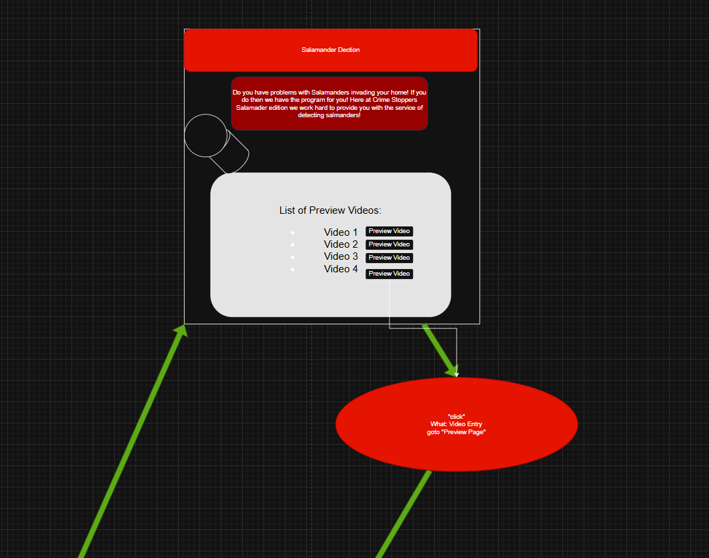
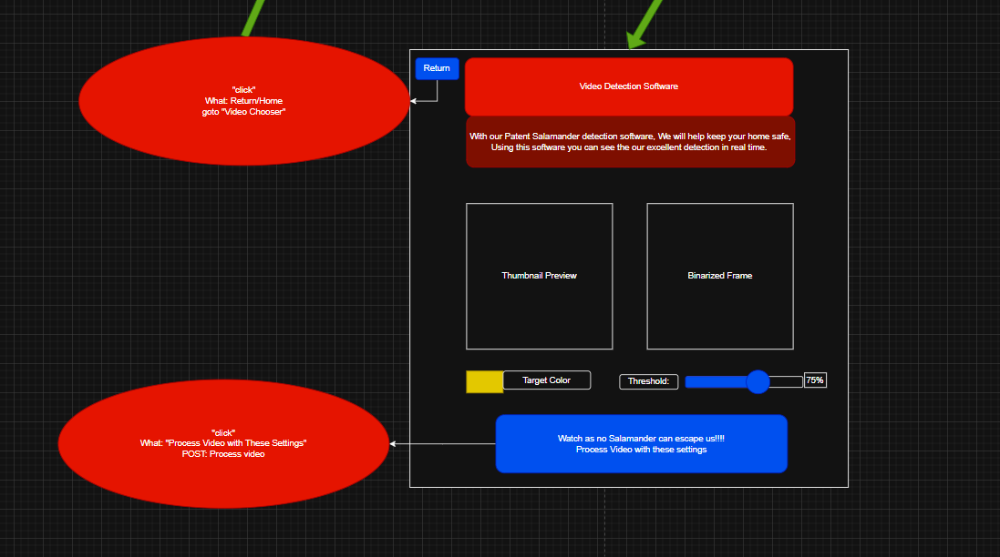

#  Salamander Tracker Project

##  Overview

This Salamander Tracker Project is a React-based frontend application deigned to help users detect salamanders in video footage using interactive tools and visual feedback. 

This project focuses on building a responsive user-friendly interface that communicates with a backend system developed seperately. While the backend handles video proecessing and detection logic, this frontend provides users with an intuitive way to interact with that data. 

---

##  Purpose

The goal of this project is to 
- Practice building a modern React application
- Develop a clean a responsive user interface
- Track salamander movement
- Integrate with an external backend API
- Provide interactive tools for analyzing video content

---

## Tech Stack

- React (via Vite)
- React Router for client-side routing
- CSS and Tailwind

---

## Project Board

  

  

---

## Authors

- Connor Hughes
- Xavier Lewis
